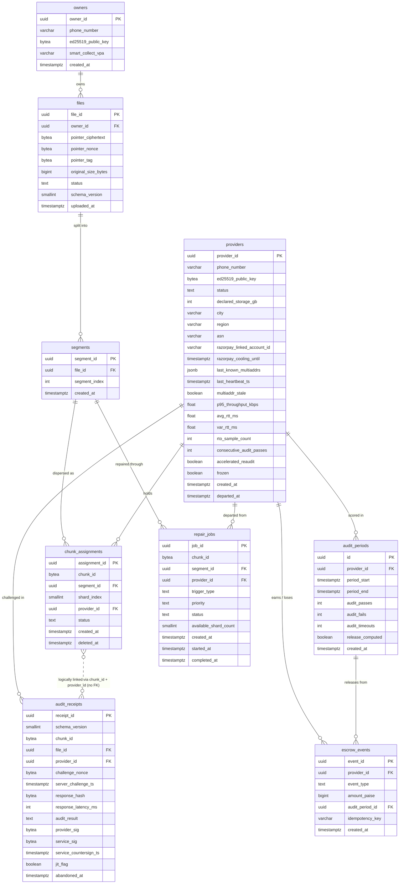

# Vyomanaut V2 — Canonical Data Model

**Status:** Authoritative; all ADRs and requirements are superior
Where this document and an ADR conflict, file an issue; do not build around the conflict.
**Version:** 1.0
**Date:** April 2026
**Source ADRs:** ADR-006, ADR-007, ADR-008, ADR-013, ADR-015, ADR-016, ADR-017, ADR-020,
ADR-024, ADR-025, ADR-027, ADR-028, ADR-029

---

## Table of Contents

1. [How to Read This Document](#1-how-to-read-this-document)
2. [Entity-Relationship Diagram](#2-entity-relationship-diagram)
3. [Design Invariants](#3-design-invariants)
4. [Table Definitions](#4-table-definitions)
   - [owners](#41-owners)
   - [providers](#42-providers)
   - [files](#43-files)
   - [segments](#44-segments)
   - [chunk_assignments](#45-chunk_assignments)
   - [audit_periods](#46-audit_periods)
   - [audit_receipts](#47-audit_receipts)
   - [escrow_events](#48-escrow_events)
   - [owner_escrow_events](#49-owner_escrow_events)
   - [repair_jobs](#410-repair_jobs)
5. [Index Catalogue](#5-index-catalogue)
6. [Row Security Policies](#6-row-security-policies)
7. [Materialised Views](#7-materialised-views)
8. [Nullable Column Justifications](#8-nullable-column-justifications)
9. [Migration Checklist](#9-migration-checklist)

---

## 1. How to Read This Document

**SQL style.** Every `CREATE TABLE` block is production-ready DDL. Column comments
explain the *why*, not just the *what*. Run `migration/001_initial_schema.sql` to
apply all tables and policies in one shot.

**Nullable column rule.** A column is nullable only when NULL carries a distinct,
documented semantic (e.g., "challenge not yet answered"). Nullable columns that exist
only because the data "might not be available yet" are not permitted — use a status
column and a strict NOT NULL constraint instead. Every nullable column has a written
justification in Section 8.

**Index rule.** Every index has a named query pattern. Indexes that cannot be linked
to a query pattern in this document must be dropped.

**Invariant rule.** Five invariants in Section 3 may never be violated by any
migration or application code path. Migrations that would break an invariant are
rejected at review time, not at runtime.

**Profile rule.** Two CHECK constraints in this document (`chunk_assignments.shard_index` and `repair_jobs.available_shard_count`) show production values in their comments but are actually parameterised from `NetworkProfile` at migration generation time via `migrations/generator.go`. In `VYOMANAUT_MODE=demo` the values differ. All other constraints, column types, and row security policies are identical in both modes. (ADR-031)

---

## 2. Entity-Relationship Diagram

Think of this system like a library. **Owners** are the people who rent storage.
**Providers** are the bookshelves. **Files** are the books. Each book is cut into
**Segments** (chapters), each chapter shredded into 56 **Chunks** (pieces of paper)
and handed out to 56 providers. Every day, each provider is quizzed (**AuditReceipt**)
to prove they still hold their piece. Providers earn money (**EscrowEvent**) for
passing the quiz. When a provider goes quiet, **RepairJobs** are raised to replace
the missing pieces.



---

## 3. Design Invariants

These five invariants may never be broken by any migration, query, or application
code path. A PR that violates any of them is rejected.

**Invariant 1 — Append-only audit log.**
`audit_receipts` is INSERT-only. The only permitted UPDATE is the two-phase write
that promotes a `PENDING` row to `PASS`/`FAIL`/`TIMEOUT` (setting `audit_result`,
`service_sig`, and `service_countersign_ts`). No DELETE ever. Enforced by the row
security policy in Section 6. (ADR-015, NFR-021)

**Invariant 2 — Append-only escrow ledger.**
`escrow_events` is INSERT-only. Balance is always computed as
`SUM(DEPOSIT) − SUM(RELEASE + SEIZURE)`. No UPDATE. No DELETE. No mutable balance
column anywhere. (ADR-016, NFR-022)

**Invariant 3 — No physical row deletion for providers.**
`providers.status` is set to `'DEPARTED'`; the row is never physically removed.
Payment history, audit history, and chunk assignment history all reference
`provider_id` — hard-deleting a provider row silently orphans these records.
(ADR-007, ADR-013)

**Invariant 4 — All financial amounts are integer paise.**
Every column that stores money is `BIGINT` in units of paise (₹1 = 100 paise).
No `FLOAT`, `NUMERIC`, or `DECIMAL` may appear anywhere in the payment path —
in tables, views, or application code. Floating-point arithmetic is non-deterministic
across systems and is a correctness violation, not a style preference. (ADR-016, NFR-046)

**Invariant 5 — Challenge nonces are always 33 bytes.**
`audit_receipts.challenge_nonce` is `BYTEA` with an `octet_length = 33` CHECK.
This is 1 version byte + 32-byte HMAC-SHA256, not 32 bytes. Changing it to 32 bytes
silently breaks cross-replica validation after a microservice failover because the
version prefix is what allows any replica to load the correct `server_secret_vN`.
(ADR-027, requirements.md §9.3)

**Invariant 6 — No real shard on vetting providers; no repair for synthetic chunks.** `chunk_assignments` rows where `is_vetting_chunk = FALSE` must have a non-null `segment_id` (referencing a real data owner segment) and must never be assigned to a provider whose `status = 'VETTING'`. Rows where `is_vetting_chunk = TRUE` must have `segment_id = NULL`. The repair scheduler must never create a `repair_jobs` row for a chunk where `is_vetting_chunk = TRUE`. These invariants are enforced by CHECK constraints in the schema and as pre-conditions in `internal/repair.EnqueueJob`. (ADR-030, NFR-034)

**Invariant 7 — ShardSize is a compile-time constant in both modes.**`ShardSize = 262,144` (256 KB) is never a field in `NetworkProfile` and never appears in
any CHECK constraint generated at runtime. All CHECK constraints that reference shard count (shard_index range, available_shard_count range) are parameterised from `NetworkProfile.TotalShards` and `NetworkProfile.DataShards` via `migrations/generator.go`, but shard size itself is hardcoded. A compiler-enforced test (`TestProfileShardSizeIsConstant`) verifies that `DemoProfile.ShardSize == ProductionProfile.ShardSize == 262144` on every commit. (ADR-031)

---

## 4. Table Definitions

### 4.1 `owners`

Data owners are the people who pay to store files. An owner has one UPI-linked
identity. All file keys derive from a master secret the owner holds locally;
the microservice never sees it.

```sql
CREATE TABLE owners (
    -- ── Identity ─────────────────────────────────────────────────────────────
    owner_id            UUID            PRIMARY KEY DEFAULT gen_random_uuid(),
    -- UUIDv7 preferred at application layer for time-ordered PKs (ADR-013).

    phone_number        VARCHAR(15)     NOT NULL UNIQUE,
    -- E.164 format (e.g. +919876543210). OTP-verified at registration (FR-001).
    -- UNIQUE: one identity per phone number prevents trivial Sybil registration.

    ed25519_public_key  BYTEA           NOT NULL CHECK (octet_length(ed25519_public_key) = 32),
    -- 32-byte compressed Ed25519 public key. Used to verify the owner's
    -- signature on the pointer file (ADR-020). Never the private key.

    -- ── Payment ──────────────────────────────────────────────────────────────
    smart_collect_vpa   VARCHAR(255),
    -- Razorpay Smart Collect 2.0 virtual UPI payment address assigned to this
    -- owner for escrow deposits. NULL until Razorpay completes VPA provisioning
    -- (typically seconds after registration). See nullable justification §8.1.

    -- ── Timestamps ───────────────────────────────────────────────────────────
    created_at          TIMESTAMPTZ     NOT NULL DEFAULT NOW()
);

COMMENT ON TABLE  owners IS 'Registered data owners. One row per verified phone number.';
COMMENT ON COLUMN owners.smart_collect_vpa IS
    'Razorpay UPI VPA for escrow deposits. NULL until provisioned by Razorpay webhook.';
```

---

### 4.2 `providers`

Providers are desktop or NAS machines running the Vyomanaut daemon. Their entire
lifecycle — from registration through vetting, active operation, and departure —
is captured here as a state machine. Physical deletion is prohibited (Invariant 3).

```sql
-- ── Status enum ──────────────────────────────────────────────────────────────
-- PENDING_ONBOARDING : registered, Razorpay cooling period not yet elapsed
-- VETTING            : first heartbeat received; accumulating audit passes
-- ACTIVE             : 80 consecutive passes achieved; full assignment eligibility
-- DEPARTED           : silent (≥72 h) or announced departure; never physically deleted
CREATE TYPE provider_status AS ENUM (
    'PENDING_ONBOARDING',
    'VETTING',
    'ACTIVE',
    'DEPARTED'
);

CREATE TABLE providers (
    -- ── Identity ─────────────────────────────────────────────────────────────
    provider_id             UUID            PRIMARY KEY DEFAULT gen_random_uuid(),

    phone_number            VARCHAR(15)     NOT NULL UNIQUE,
    -- OTP-verified at registration. UNIQUE prevents a single person flooding
    -- the network with fake provider identities (Sybil defence, ADR-005).

    ed25519_public_key      BYTEA           NOT NULL CHECK (octet_length(ed25519_public_key) = 32),
    -- The provider's libp2p peer key. Registered with the microservice at join time.
    -- The libp2p Peer ID is multihash(public_key). Used to authenticate every
    -- heartbeat and audit receipt (ADR-021).

    -- ── Lifecycle ────────────────────────────────────────────────────────────
    status                  provider_status NOT NULL DEFAULT 'PENDING_ONBOARDING',

    -- ── Hardware declaration ─────────────────────────────────────────────────
    declared_storage_gb     INT             NOT NULL CHECK (declared_storage_gb BETWEEN 10 AND 100000),
    -- Self-declared. Minimum 10 GB (floor for meaningful participation).
    -- Maximum 100,000 GB (100 TB) caps unrealistic declarations from bad actors.
    -- Verified indirectly by vetting audits. The assignment
    -- service refuses chunk assignments once this ceiling is reached (FR-030).

    city                    VARCHAR(100)    NOT NULL,
    -- Human-readable city for the operator dashboard. Not used for cap enforcement.

    region                  VARCHAR(100)    NOT NULL,
    -- One of: 'Delhi NCR', 'Mumbai', 'Bangalore', 'Hyderabad', 'Chennai', etc.
    -- Used by the readiness gate to verify ≥3 distinct metro regions (ADR-029).

    asn                     VARCHAR(32)     NOT NULL,
    -- Autonomous System Number: e.g. 'AS24560' (Airtel), 'AS17813' (BSNL),
    -- or 'SIM-AS1' … 'SIM-AS5' in simulation mode (ADR-029).
    -- The assignment service uses this to enforce the 20% ASN cap (ADR-014).

    -- ── Payment rails ────────────────────────────────────────────────────────
    razorpay_linked_account_id  VARCHAR(255),
    -- Razorpay Route Linked Account ID (format: 'acc_XXXXXXXXXXXXXXXX').
    -- NULL until Razorpay completes account creation. Payments are blocked
    -- until this is populated AND the cooling period has elapsed. See §8.2.

    razorpay_cooling_until  TIMESTAMPTZ,
    -- Razorpay requires a 24-hour cooling period before the first transfer to a
    -- new Linked Account (Paper 35). NULL until account creation is confirmed.
    -- The assignment service checks: cooling_until IS NULL OR cooling_until < NOW().
    -- See §8.3.

    -- ── Network addresses (ADR-028) ──────────────────────────────────────────
    last_known_multiaddrs   JSONB           NOT NULL DEFAULT '[]',
    -- Ordered JSON array of libp2p multiaddrs reported by the most recent
    -- heartbeat. The audit scheduler dials these in order. Example:
    -- ["/ip4/1.2.3.4/udp/4001/quic-v1/p2p/12D3Koo...",
    --  "/ip4/192.168.1.2/udp/4001/quic-v1/p2p/12D3Koo..."]
    -- The assignment service uses this as the PRIMARY address source; DHT is
    -- fallback only (ADR-028).

    last_heartbeat_ts       TIMESTAMPTZ,
    -- NULL for brand-new providers that have registered but not yet sent a
    -- heartbeat. After the first heartbeat this is always non-null. Used by
    -- the departure detector: absence ≥72h triggers silent departure (ADR-006).
    -- See nullable justification §8.4.

    multiaddr_stale         BOOLEAN         NOT NULL DEFAULT FALSE,
    -- Set TRUE when 2+ consecutive heartbeats are missed (8–12 hours of silence).
    -- Triggers DHT fallback for challenge dispatch. Cleared on next successful
    -- heartbeat (ADR-028).

    -- ── Performance counters (ADR-006, ADR-014) ──────────────────────────────
    p95_throughput_kbps     FLOAT          NULL,
    -- 95th-percentile upload throughput in KB/s measured during vetting audits.
    -- Used to derive the per-provider audit deadline:
    --   deadline_ms = (chunk_size_kb / p95_throughput_kbps) × 1500
    -- Seeded to 0 (uses pool median) until vetting accumulates enough samples.
    -- Updated via EWMA after every PASS audit response (ADR-014).
    -- NULL = unestablished; application substitutes pool median
    -- The previous state was set to NOT NULL and DEFAULT 0 but if any code path computes deadline_ms = (256 / 0) × 1.5 before checking for 0, it produces a division-by-zero or infinite deadline.

    avg_rtt_ms              FLOAT           NULL,
    -- EWMA mean of recent audit response latencies. Seeded to 2000ms (2 seconds)
    -- for new providers, which is conservative but safe. Used in the per-provider
    -- RTO formula: RTO = avg_rtt_ms + 4 × var_rtt_ms (ADR-006).
    -- NULL = unestablished; application substitutes pool median
    -- The default was set to 2000ms which was a hard-coded guess, not the pool median. As the network's actual median shifts, this default becomes increasingly wrong

    var_rtt_ms              FLOAT           NOT NULL DEFAULT 0,
    -- EWMA variance of recent audit response latencies. Zero for new providers
    -- (unknown variance). RTO is dominated by avg_rtt_ms until variance is
    -- established.
    -- zero variance is safe as initial assumption

    rto_sample_count        INT             NOT NULL DEFAULT 0,
    -- Number of audit responses that have updated avg_rtt_ms and var_rtt_ms.
    -- Below 5, the scheduler substitutes the pool-median RTO. At and above 5,
    -- the per-provider formula is used (ADR-006).

    first_chunk_assignment_at   TIMESTAMPTZ,
    -- NULL until the assignment service assigns the provider's first chunk.
    -- The vetting advancement check compares NOW() - first_chunk_assignment_at >= INTERVAL '120 days' (FR-026).
    -- Cannot use created_at: registration → first assignment gap is variable (minimum 24h cooling).

    -- ── Vetting counters (ADR-005) ────────────────────────────────────────────
    consecutive_audit_passes INT            NOT NULL DEFAULT 0,
    -- Count of back-to-back PASS results without a FAIL or TIMEOUT in between.
    -- Resets to 0 on any non-PASS result. When this reaches 80, the status
    -- transitions from VETTING → ACTIVE (Jeffrey's prior threshold, ADR-005).

    -- ── Failure clustering (ADR-008, Paper 32) ───────────────────────────────
    accelerated_reaudit     BOOLEAN         NOT NULL DEFAULT FALSE,
    -- Set TRUE when >1 FAIL is recorded in the rolling 7-day window. Triggers
    -- the scheduler to re-audit ALL of this provider's chunks on an accelerated
    -- schedule, because a provider with a recent uncorrectable error has 30×
    -- elevated probability of further failures (Schroeder et al., Paper 32).

    -- ── Escrow freeze (ADR-024) ──────────────────────────────────────────────
    frozen                  BOOLEAN         NOT NULL DEFAULT FALSE,
    -- Set TRUE when a silent departure is declared. No new DEPOSIT events are
    -- accepted for a frozen provider. All pending escrow is seized.

    -- ── Timestamps ───────────────────────────────────────────────────────────
    created_at              TIMESTAMPTZ     NOT NULL DEFAULT NOW(),

    departed_at             TIMESTAMPTZ,
    -- NULL for active providers. Set to the timestamp of departure declaration
    -- (either announced departure or 72h silent timeout). Never cleared. See §8.5.

    -- ── Constraints ──────────────────────────────────────────────────────────
    CONSTRAINT providers_throughput_nonneg  CHECK (p95_throughput_kbps >= 0),
    CONSTRAINT providers_avg_rtt_nonneg     CHECK (avg_rtt_ms >= 0),
    CONSTRAINT providers_var_rtt_nonneg     CHECK (var_rtt_ms >= 0),
    CONSTRAINT providers_passes_nonneg      CHECK (consecutive_audit_passes >= 0),
    CONSTRAINT providers_departed_status
        CHECK (departed_at IS NULL OR status = 'DEPARTED')
    -- A departed_at timestamp must coincide with DEPARTED status. An active
    -- provider cannot have a departure timestamp.
);

COMMENT ON TABLE providers IS
    'Storage providers. One row per verified daemon installation. Never physically deleted.';
COMMENT ON COLUMN providers.status IS
    'State machine: PENDING_ONBOARDING → VETTING (first heartbeat) → ACTIVE '
    '(80 consecutive passes) → DEPARTED (72h silent or announced). Terminal state.';
COMMENT ON COLUMN providers.asn IS
    '20% ASN cap enforcement: no single ASN may hold >20% of any file''s 56 shards (ADR-014).';
COMMENT ON COLUMN providers.declared_storage_gb IS
    'Self-declared storage allocation. During VETTING status, the assignment service '
    'caps synthetic chunk allocation at floor(declared_storage_gb × 400) active chunks '
    '(~10% of declared storage). After ACTIVE status, real shard assignments ramp to the '
    'full declared_storage_gb limit. (ADR-030)';
```

---

### 4.3 `files`

A file is the data owner's logical storage unit. Physically, the file is encrypted
before upload and split into segments. The microservice stores only the encrypted
pointer file ciphertext — it cannot decrypt it (ADR-020, zero-knowledge property).

```sql
CREATE TYPE file_status AS ENUM ('ACTIVE', 'DELETION_PENDING', 'DELETED');

CREATE TABLE files (
    -- ── Identity ─────────────────────────────────────────────────────────────
    file_id             UUID            PRIMARY KEY DEFAULT gen_random_uuid(),
    -- UUIDv7 at application layer. Pseudonymous: the file_id appears in audit
    -- receipts but cannot be linked to plaintext file identity without the
    -- owner's master secret (ADR-017).

    owner_id            UUID            NOT NULL REFERENCES owners (owner_id),

    -- ── Pointer file storage (ADR-020) ───────────────────────────────────────
    pointer_ciphertext  BYTEA           NOT NULL,
    -- AEAD_CHACHA20_POLY1305 ciphertext of the pointer file struct. Contains:
    -- provider_ids[56], chunk_ids[56], erasure_params, owner_sig.
    -- The microservice stores this blindly and cannot decrypt it.
    -- Key = HKDF(master_secret, "vyomanaut-pointer-v1" || file_id). The
    -- master_secret is never transmitted to the microservice (ADR-020).

    pointer_nonce       BYTEA           NOT NULL CHECK (octet_length(pointer_nonce) = 12),
    -- 96-bit (12-byte) monotone counter nonce for the AEAD operation.
    -- RFC 8439 §2.3: nonce must be unique per (key, nonce) pair.
    -- Stored here so the owner can re-derive the key and decrypt on a new device.

    pointer_tag         BYTEA           NOT NULL CHECK (octet_length(pointer_tag) = 16),
    -- 16-byte Poly1305 authentication tag. Verified with constant-time comparison
    -- before any decryption attempt is made (NFR-019).

    -- ── File name (nullable) ─────────────────────────────────────────────────────────
    display_name_ciphertext  BYTEA,
    -- AEAD_CHACHA20_POLY1305 ciphertext of the user-provided file name.
    -- Key = HKDF(master_secret, "vyomanaut-filename-v1" || file_id).
    -- NULL is acceptable if the owner provides no label (files are identified by
    -- file_id in the CLI). Non-null for the web/desktop UI file list view (FR-019).
    -- The microservice stores this blindly; it cannot read the file name.
    display_name_nonce       BYTEA     CHECK (octet_length(display_name_nonce) = 12 OR display_name_nonce IS NULL),

    display_name_tag         BYTEA     CHECK (octet_length(display_name_tag) = 16 OR display_name_tag IS NULL),

    -- ── File metadata ─────────────────────────────────────────────────────────
    original_size_bytes BIGINT          NOT NULL CHECK (original_size_bytes > 0),
    -- The plaintext file size before padding. Required to strip AONT padding
    -- bytes (files <4 MB are padded to one full segment = 4 MB) after RS decode
    -- and AONT decryption on retrieval (FR-008).

    status              file_status     NOT NULL DEFAULT 'ACTIVE',
    -- ACTIVE: all chunk assignments live; owner is billed.
    -- DELETED: deletion request received; chunk_assignments transitioning to
    -- PENDING_DELETION → DELETED. Owner is not billed after deletion.

    schema_version      SMALLINT        NOT NULL DEFAULT 1,
    -- Pointer file schema version. Allows forward-compatible migration when the
    -- pointer file struct must evolve in V3.

    -- ── Timestamps ───────────────────────────────────────────────────────────
    uploaded_at         TIMESTAMPTZ     NOT NULL DEFAULT NOW()
);

COMMENT ON TABLE files IS
    'One row per uploaded file. The microservice holds only encrypted pointer '
    'ciphertext and cannot read the file contents or decryption key.';
COMMENT ON COLUMN files.pointer_ciphertext IS
    'Blind store. Key lives in the owner''s head. Service cannot decrypt (ADR-020).';
COMMENT ON COLUMN files.original_size_bytes IS
    'Strip AONT padding to this length after decoding. Padding is added for '
    'files smaller than one full segment (4 MB = 16 × 256 KB).';
```

---

### 4.4 `segments`

Files larger than 14 MB (one encoded segment = 56 × 256 KB on the wire) are split
into multiple segments. Every segment is processed independently through the AONT-RS
pipeline. Losing all 56 shards of one segment does not affect other segments.

```sql
CREATE TABLE segments (
    segment_id      UUID    PRIMARY KEY DEFAULT gen_random_uuid(),

    file_id         UUID    NOT NULL REFERENCES files (file_id),

    segment_index   INT     NOT NULL CHECK (segment_index >= 0),
    -- 0-based. Segments are concatenated in this order on retrieval to
    -- reconstruct the original file.

    created_at      TIMESTAMPTZ NOT NULL DEFAULT NOW(),

    CONSTRAINT segments_unique_index UNIQUE (file_id, segment_index)
    -- A file cannot have two segments at the same position.
);

COMMENT ON TABLE segments IS
    'One row per 14 MB slice of a file. Each segment produces exactly 56 chunks '
    '(shards) via AONT-RS(16,56). Segments are independent: losing one does not '
    'affect the others.';
```

---

### 4.5 `chunk_assignments`

A chunk assignment records which provider holds which shard of which segment. This
is the routing table for both audit challenge dispatch and repair. The 20% ASN cap
is enforced at INSERT time by the assignment service (ADR-014, ADR-005).

```sql
CREATE TYPE assignment_status AS ENUM (
    'ACTIVE',           -- provider holds this shard; audit challenges issued daily
    'REPAIRING',        -- shard is being replaced; old holder still being challenged
    'PENDING_DELETION', -- owner deleted file (or ACTIVE transition GC in progress);
                        -- provider notified to GC its vLog; no further challenges issued
    'DELETED'           -- provider confirmed deletion; no further challenge issued
);

CREATE TABLE chunk_assignments (
    assignment_id   UUID                PRIMARY KEY DEFAULT gen_random_uuid(),

    chunk_id        BYTEA               NOT NULL CHECK (octet_length(chunk_id) = 32),
    -- SHA-256(shard_data): the content address of this specific 256 KB shard.
    -- For real shards: SHA-256 of the AONT-RS encoded shard.
    -- For synthetic vetting chunks: SHA-256 of a random 256 KB block generated by
    -- the microservice. The provider cannot distinguish real from synthetic.

    is_vetting_chunk BOOLEAN            NOT NULL DEFAULT FALSE,
    -- TRUE for synthetic chunks assigned during the provider vetting period (ADR-030).
    -- Synthetic chunks have segment_id = NULL and shard_index = NULL.
    -- The repair scheduler MUST NOT create repair_jobs for is_vetting_chunk = TRUE rows.
    -- The provider daemon has no visibility into this flag; it stores and serves audits
    -- for synthetic chunks through the identical code paths as real shards.

    segment_id      UUID                REFERENCES segments (segment_id),
    -- NULL when is_vetting_chunk = TRUE (no real file association).
    -- NOT NULL when is_vetting_chunk = FALSE (enforced by constraint below).
    -- Used by the repair scheduler to find surviving holders for RS decode.

    shard_index     SMALLINT            CHECK (shard_index BETWEEN 0 AND 55 OR shard_index IS NULL),
    -- NULL when is_vetting_chunk = TRUE (no RS scheme applies to synthetic chunks).
    -- NOT NULL when is_vetting_chunk = FALSE (enforced by constraint below).
    -- Shards 0–15 are AONT systematic codewords; shards 16–55 are RS parity (ADR-022).
    -- Upper bound (55) is TotalShards-1 = 56-1 in production.
    -- In VYOMANAUT_MODE=demo (TotalShards=5) this bound is 4.
    -- The actual constraint value is emitted by migrations/generator.go from
    -- NetworkProfile.TotalShards-1 at migration generation time, not hardcoded here.
    -- This comment shows the production value. (ADR-031)

    provider_id     UUID                NOT NULL REFERENCES providers (provider_id),

    status          assignment_status   NOT NULL DEFAULT 'ACTIVE',

    created_at      TIMESTAMPTZ         NOT NULL DEFAULT NOW(),

    deleted_at      TIMESTAMPTZ,
    -- NULL for all non-DELETED assignments. Set when status transitions to DELETED.

    -- ── Constraints ──────────────────────────────────────────────────────────

    CONSTRAINT chunk_assignments_segment_and_shard_null_iff_vetting CHECK (
        (is_vetting_chunk = FALSE AND segment_id IS NOT NULL AND shard_index IS NOT NULL)
        OR
        (is_vetting_chunk = TRUE  AND segment_id IS NULL    AND shard_index IS NULL)
    ),
    -- Enforces Invariant 6: real chunks always reference a segment and a shard slot;
    -- synthetic chunks never do.

    CONSTRAINT chunk_assignments_one_per_provider_per_chunk
        UNIQUE (chunk_id, provider_id)
    -- A provider cannot be assigned the same content-addressed chunk twice,
    -- whether real or synthetic.
);

-- Partial unique index: one active assignment per shard slot per segment (real chunks only).
-- Synthetic chunks are excluded (they have no shard_index and no RS constraint applies).
CREATE UNIQUE INDEX idx_chunk_assignments_one_active_per_shard
    ON chunk_assignments (segment_id, shard_index)
    WHERE is_vetting_chunk = FALSE
      AND status IN ('ACTIVE', 'REPAIRING');

-- Read view: the challenge scheduler sees only non-deleted assignments.
-- Filters out both DELETED real shards and DELETED/PENDING_DELETION synthetic chunks.
CREATE VIEW active_chunk_assignments AS
SELECT *
FROM chunk_assignments
WHERE status = 'ACTIVE';

-- Grant SELECT on this view to the vyomanaut_app role.
-- Revoke direct SELECT on chunk_assignments from vyomanaut_app for the
-- challenge scheduler path. The scheduler physically cannot see DELETED rows.


COMMENT ON TABLE chunk_assignments IS
    'Routing table: which provider holds which shard of which segment. '
    '20% ASN cap enforced at INSERT time by the assignment service (ADR-014). '
    'On provider SILENT/ANNOUNCED departure: status → DELETED, challenge issuance stops.'
    'Physical deletion is NOT performed — historical assignment data is preserved for '
    'audit reconciliation.'
    'On file owner deletion: status → PENDING_DELETION → DELETED after provider GC confirms.';
COMMENT ON COLUMN chunk_assignments.chunk_id IS
    'SHA-256(shard_data). RocksDB lookup key on the provider daemon (ADR-023). '
    'Also the audit receipt''s reference to the challenged content.';
COMMENT ON COLUMN chunk_assignments.shard_index IS
    'Shards 0–15 are AONT systematic codewords (data). Shards 16–55 are RS parity.';
COMMENT ON COLUMN chunk_assignments.is_vetting_chunk IS
    'TRUE for synthetic vetting chunks (ADR-030). Synthetic chunks have segment_id = NULL '
    'and shard_index = NULL. The repair scheduler must not enqueue repair jobs for these rows. '
    'The provider daemon cannot distinguish synthetic from real chunks.';

COMMENT ON COLUMN chunk_assignments.segment_id IS
    'NULL for synthetic vetting chunks (is_vetting_chunk = TRUE). '
    'NOT NULL for real file shards (enforced by CHECK constraint).';

COMMENT ON COLUMN chunk_assignments.shard_index IS
    'NULL for synthetic vetting chunks (no RS shard slot assigned). '
    'NOT NULL for real file shards (0–55). See ADR-022 for shard semantics.';
```

---

### 4.6 `audit_periods`

An audit period groups one calendar month of audit results for a single provider.
It is the unit of escrow calculation: at month-end, the microservice queries this
table for each provider's pass rate, computes the release multiplier, and fires
the Razorpay transfer (ADR-024, ADR-016).

```sql
CREATE TABLE audit_periods (
    id              UUID            PRIMARY KEY DEFAULT gen_random_uuid(),

    provider_id     UUID            NOT NULL REFERENCES providers (provider_id),

    period_start    TIMESTAMPTZ     NOT NULL,
    period_end      TIMESTAMPTZ     NOT NULL,
    -- Inclusive start, exclusive end. One row per calendar month per provider.
    -- Typically period_start = first second of the month,
    -- period_end = first second of the following month.

    -- ── Running tallies (denormalised from audit_receipts) ────────────────────
    audit_passes    INT             NOT NULL DEFAULT 0 CHECK (audit_passes >= 0),
    audit_fails     INT             NOT NULL DEFAULT 0 CHECK (audit_fails >= 0),
    audit_timeouts  INT             NOT NULL DEFAULT 0 CHECK (audit_timeouts >= 0),
    -- Materialised tallies, updated asynchronously after each audit receipt is
    -- countersigned. Source of truth for scoring queries. Raw counts are always
    -- re-computable from audit_receipts if the materialised view drifts.

    release_computed BOOLEAN        NOT NULL DEFAULT FALSE,
    -- Set TRUE once the monthly release multiplier has been computed and the
    -- Razorpay PATCH call has been made. Prevents double-processing if the
    -- monthly job is accidentally re-run.

    created_at      TIMESTAMPTZ     NOT NULL DEFAULT NOW(),

    CONSTRAINT audit_periods_no_overlap
        -- PREREQUISITE: CREATE EXTENSION IF NOT EXISTS btree_gist;
        -- This constraint will fail at DDL time if btree_gist is not installed.
        -- btree_gist is required to use the = operator (for UUID) inside EXCLUDE.
        EXCLUDE USING gist (
            provider_id WITH =,
            tstzrange(period_start, period_end, '[)') WITH &&
        ),
    -- Two audit periods for the same provider must not overlap. Uses the
    -- btree_gist extension. Prevents double-counting of audits at month
    -- boundaries.

    CONSTRAINT audit_periods_start_before_end
        CHECK (period_start < period_end)
);

COMMENT ON TABLE audit_periods IS
    'One row per calendar month per provider. Denormalised tally for scoring '
    'and release computation. Source of truth for the escrow release multiplier.';
```

---

### 4.7 `audit_receipts`

The audit receipt table is the heart of the Vyomanaut trust model. Every storage
proof event — PASS, FAIL, TIMEOUT, or in-flight PENDING — creates exactly one
INSERT here. No row is ever updated except during the two-phase PENDING → final
write (ADR-015). No row is ever deleted (Invariant 1, ADR-015, NFR-021).

>**NOTE:**-- No FK to chunk_assignments. chunk_assignments may be soft-deleted on provider departure while audit_receipts must remain permanently (Invariant 1). The logical link is: chunk_assignments.chunk_id = audit_receipts.chunk_id AND chunk_assignments.provider_id = audit_receipts.provider_id. This is enforced at the application layer only.

```sql
-- ── Audit result type ─────────────────────────────────────────────────────────
-- PASS / FAIL / TIMEOUT are the three terminal states. The column is nullable
-- (no NOT NULL) to represent the in-flight PENDING state during the two-phase
-- write (ADR-015). Defining this as an ENUM — rather than TEXT with a CHECK —
-- is consistent with all other status columns and prevents invalid string
-- values at the Postgres wire protocol level before any constraint fires.
CREATE TYPE audit_result_type AS ENUM ('PASS', 'FAIL', 'TIMEOUT');

CREATE TABLE audit_receipts (
    -- ── Primary key ──────────────────────────────────────────────────────────
    receipt_id              UUID            PRIMARY KEY DEFAULT gen_random_uuid(),
    -- UUIDv7 at application layer. Time-ordered; no coordinator needed (ADR-013).

    schema_version          SMALLINT        NOT NULL DEFAULT 1,
    -- Forward-compatibility: increment when any field is added or semantics
    -- change. Old rows remain queryable with the old schema_version.

    -- ── What was challenged ───────────────────────────────────────────────────
    chunk_id                BYTEA           NOT NULL CHECK (octet_length(chunk_id) = 32),
    -- SHA-256 of the chunk content (content address). Matches chunk_assignments.chunk_id.

    file_id                 UUID           REFERENCES files (file_id),
    -- Pseudonymous file handle. Stored in the audit log for operator tooling
    -- but cannot be linked to a plaintext filename without the owner's master
    -- secret. Closes DHT privacy Challenge 3 (SoK, ADR-001).
    -- NULL when this audit is for a synthetic vetting chunk (is_vetting_chunk = TRUE
    -- on the corresponding chunk_assignments row). Non-null for all real shard audits.
    -- The audit scheduler sets file_id = NULL when issuing challenges for synthetic chunks.
    -- See nullable justification §8.18.

    provider_id             UUID            NOT NULL REFERENCES providers (provider_id),

    -- ── Challenge parameters (ADR-017, ADR-027) ───────────────────────────────
    challenge_nonce         BYTEA           NOT NULL CHECK (octet_length(challenge_nonce) = 33),
    -- 33 bytes: 1-byte version prefix || HMAC-SHA256(server_secret_vN, chunk_id || server_ts).
    -- The version byte identifies which server_secret version was used, allowing
    -- any replica to validate any challenge across failover (ADR-027).
    -- MUST be BYTEA(33), not BYTEA(32). See requirements.md §9.3 and ADR-027.

    server_challenge_ts     TIMESTAMPTZ     NOT NULL,
    -- Timestamp generated by the microservice at challenge time, embedded in the
    -- nonce HMAC. Providers cannot backdate a challenge by manipulating this
    -- field because they never see the raw server_secret (ADR-017).

    -- ── Provider response ─────────────────────────────────────────────────────
    response_hash           BYTEA           CHECK (
                                octet_length(response_hash) = 32 OR response_hash IS NULL
                            ),
    -- SHA-256(chunk_data || challenge_nonce). NULL for TIMEOUT (no response
    -- received) and NULL during the PENDING in-flight state. See §8.7.

    response_latency_ms     INT             CHECK (response_latency_ms >= 0 OR
                                                   response_latency_ms IS NULL),
    -- Milliseconds between challenge dispatch and receipt of the provider's
    -- signed response. NULL for TIMEOUT (no response). Used as the JIT
    -- retrieval detector: anomalously fast responses (<0.3× deadline) set
    -- jit_flag=TRUE (ADR-014 Defence 3). See §8.8.

    -- ── Audit result (two-phase write, ADR-015) ───────────────────────────────
    audit_result            audit_result_type,
    -- NULL = in-flight PENDING (Phase 1 of two-phase write is complete; Phase 2
    -- not yet executed). PASS / FAIL / TIMEOUT = final result. NULL is not a
    -- missing value — it is a meaningful state. See §8.9.
    -- Using audit_result_type (ENUM) rather than TEXT ensures Postgres rejects
    -- invalid strings at the wire protocol level, not just at constraint check time.

    address_was_stale  BOOLEAN  NOT NULL DEFAULT FALSE,
    -- TRUE if challenge was dispatched via DHT fallback (providers.multiaddr_stale = TRUE
    -- at dispatch time). TIMEOUTs with this flag set do NOT reset consecutive_audit_passes.
    -- We keep 80 consecutive passes. With a mitigation: if audit_result = 'TIMEOUT' and providers.multiaddr_stale = TRUE at the time of the challenge (meaning the scheduler fell back to DHT because no heartbeat was received), do not reset the consecutive counter. A TIMEOUT caused by a known-stale address is not evidence of provider failure; it is evidence of the DHT fallback not working. The reset should only trigger on TIMEOUTs where the microservice had a fresh heartbeat address and the provider still did not respond.

    -- ── Signatures (dual Ed25519, ADR-017) ───────────────────────────────────
    provider_sig            BYTEA           CHECK (
                                octet_length(provider_sig) = 64 OR provider_sig IS NULL
                            ),
    -- Ed25519 signature by the provider over all fields above (challenge_nonce,
    -- response_hash, server_challenge_ts, etc.). NULL for TIMEOUT (the provider
    -- never responded) and NULL during PENDING. The microservice verifies this
    -- signature before writing a PASS or FAIL. See §8.10.

    service_sig             BYTEA           CHECK (
                                octet_length(service_sig) = 64 OR service_sig IS NULL
                            ),
    -- Ed25519 countersignature by the microservice:
    --   For PASS/FAIL: Ed25519(microservice_key, provider_sig || service_countersign_ts)
    --   For TIMEOUT:   Ed25519(microservice_key, provider_id || chunk_id || challenge_nonce
    --                          || server_challenge_ts || 'TIMEOUT' || service_countersign_ts)
    --   For PENDING:   NULL (Phase 2 not yet executed)
    -- The two signing inputs are different. Verifiers must branch on audit_result. See §8.11.

    service_countersign_ts  TIMESTAMPTZ,
    -- NULL during PENDING. Set in Phase 2 alongside service_sig. See §8.12.

    -- ── Adversarial detection flags (ADR-014) ────────────────────────────────
    jit_flag                BOOLEAN         NOT NULL DEFAULT FALSE,
    -- TRUE when response_latency_ms < (chunk_size_kb / p95_throughput_kbps) × 0.3.
    -- Flags an anomalously fast response consistent with just-in-time retrieval
    -- from a co-located node rather than genuine local disk read (ADR-014).

    -- ── Garbage collection (ADR-015) ──────────────────────────────────────────
    abandoned_at            TIMESTAMPTZ,
    -- NULL for all non-abandoned rows. Set by a background GC process on PENDING
    -- rows that are still NULL after 48 hours. These are rows where the
    -- microservice issued Phase 1 but crashed before Phase 2. ABANDONED rows are
    -- excluded from all scoring windows (treated as neither PASS nor FAIL).
    -- See §8.13.

    -- ── Constraints ──────────────────────────────────────────────────────────
    CONSTRAINT audit_receipts_nonce_unique
        UNIQUE (challenge_nonce),
    -- Prevents replay: a provider cannot re-submit a response to an already-
    -- recorded challenge. The microservice returns the existing countersignature
    -- on a duplicate nonce (idempotent retry protocol, ADR-015).

    CONSTRAINT audit_receipts_response_consistency CHECK (
        -- A PASS or FAIL must have a response_hash and provider_sig.
        (audit_result IN ('PASS', 'FAIL') AND
         response_hash IS NOT NULL AND
         provider_sig IS NOT NULL)
        OR
        -- A TIMEOUT has no response_hash or provider_sig.
        (audit_result = 'TIMEOUT' AND
         response_hash IS NULL AND
         provider_sig IS NULL)
        OR
        -- PENDING (NULL result) has no constraints on response yet.
        (audit_result IS NULL)
    ),

    CONSTRAINT audit_receipts_service_sig_consistency CHECK (
        -- Once service_sig is set, service_countersign_ts must also be set.
        (service_sig IS NULL) = (service_countersign_ts IS NULL)
    )

    -- Note: this constraint cannot reference chunk_assignments directly (no FK).
    -- Enforcement is at the application layer: the audit scheduler must set file_id = NULL
    -- for synthetic chunk challenges and non-null for real chunk challenges.
    -- The invariant is: file_id IS NULL iff the audited chunk is a synthetic vetting chunk.
    -- Monitored via: SELECT COUNT(*) FROM audit_receipts ar
    --   JOIN chunk_assignments ca ON ca.chunk_id = ar.chunk_id AND ca.provider_id = ar.provider_id
    --   WHERE ar.file_id IS NULL AND ca.is_vetting_chunk = FALSE;
    -- This query must return 0. Run as part of nightly data integrity checks.
);

COMMENT ON TABLE audit_receipts IS
    'Immutable audit log. Every storage proof event: PASS, FAIL, TIMEOUT, or '
    'in-flight PENDING. INSERT only — the only permitted UPDATE promotes a '
    'PENDING row to its final state (audit_result, service_sig, '
    'service_countersign_ts). No DELETE ever. (ADR-015, NFR-021)';
COMMENT ON COLUMN audit_receipts.challenge_nonce IS
    'BYTEA(33): 1-byte version || 32-byte HMAC. NOT BYTEA(32). '
    'The version byte enables cross-replica validation after failover (ADR-027).';
COMMENT ON COLUMN audit_receipts.audit_result IS
    'NULL = PENDING (in-flight, Phase 1 complete). '
    'PASS/FAIL/TIMEOUT = final state set in Phase 2. '
    'NULL is a meaningful state, not a missing value.';
```

---

### 4.8 `escrow_events`

The escrow ledger. All money flows are append-only events. The running balance is
never stored — it is always recomputed as `SUM(DEPOSIT) − SUM(RELEASE + SEIZURE)`
(Invariant 2, ADR-016). Every amount is integer paise (₹1 = 100 paise). No
floating-point arithmetic anywhere in this table or in any code path that reads it.

```sql
CREATE TYPE escrow_event_type AS ENUM (
    'DEPOSIT',   -- data owner funds escrow; triggers on Razorpay webhook
    'RELEASE',   -- monthly payment released to provider after multiplier applied
    'SEIZURE',   -- all held earnings seized on silent departure (ADR-024)
    'REVERSAL'   -- 
);

CREATE TABLE escrow_events (
    event_id            UUID                PRIMARY KEY DEFAULT gen_random_uuid(),
    -- UUIDv7 at application layer. Time-ordered.

    provider_id         UUID                NOT NULL REFERENCES providers (provider_id),
    -- The provider whose escrow balance changes. For DEPOSIT events, this is the
    -- provider who earned the credit. For SEIZURE, it is the departing provider.

    event_type          escrow_event_type   NOT NULL,

    amount_paise        BIGINT              NOT NULL CHECK (amount_paise > 0),
    -- Always positive integer paise (₹1 = 100 paise). The sign is implied by
    -- event_type: DEPOSIT adds; RELEASE and SEIZURE subtract.
    -- No DECIMAL, no FLOAT, no NUMERIC. Ever. (ADR-016, NFR-046)

    audit_period_id     UUID                REFERENCES audit_periods (id),
    -- NULL for DEPOSIT events (not tied to a specific audit period — triggered
    -- by data owner UPI payment) and for SEIZURE events (full balance seized).
    -- Non-null for RELEASE events, linking the payment to the audit period it
    -- covers. See nullable justification §8.14.

    idempotency_key     VARCHAR(64)         NOT NULL UNIQUE,
    -- SHA-256(provider_id || audit_period) for RELEASE events, or a
    -- unique key for DEPOSIT (webhook_id) and SEIZURE (departure_event_id).
    -- Passed as the X-Payout-Idempotency header to Razorpay (mandatory since
    -- 15 March 2025, Paper 35, ADR-012). Prevents double-payment if the
    -- monthly release job is accidentally re-triggered.

    created_at          TIMESTAMPTZ         NOT NULL DEFAULT NOW()
);

COMMENT ON TABLE escrow_events IS
    'Append-only escrow ledger. Balance = SUM(DEPOSIT) - SUM(RELEASE + SEIZURE) '
    'per provider_id. No UPDATE. No DELETE. No mutable balance column. '
    'All amounts in integer paise (ADR-016, Invariant 2).';
COMMENT ON COLUMN escrow_events.amount_paise IS
    'Integer paise ONLY. ₹1 = 100 paise. Floating-point is a correctness '
    'violation in the payment path, not a style issue (NFR-046).';
COMMENT ON COLUMN escrow_events.idempotency_key IS
    'Passed to Razorpay as X-Payout-Idempotency. Mandatory since 15 Mar 2025. '
    'Format for RELEASE: SHA-256(provider_id || audit_period) as 64 hex chars.';
```

---

### 4.9 `owner_escrow_events`

FR-021 requires a balance view showing "current balance, amount reserved for active files, amount available for withdrawal." FR-059 requires withdrawal. FR-006 requires deposit tracking. FR-014 requires checking if the owner has sufficient balance before upload.
None of these can be computed from the current schema. The owners table has no balance information. So there is need for an owner_escrow_events table.

```sql
CREATE TYPE owner_escrow_event_type AS ENUM (
    'DEPOSIT',      -- data owner funds escrow via UPI Smart Collect 2.0
    'CHARGE',       -- monthly storage deduction per active file (per-audit-pass credits)
    'WITHDRAWAL',   -- owner withdraws available balance to their bank account
    'REFUND'        -- file deleted early; unused prepaid storage refunded
);

CREATE TABLE owner_escrow_events (
    event_id            UUID                        PRIMARY KEY DEFAULT gen_random_uuid(),
    owner_id            UUID                        NOT NULL REFERENCES owners (owner_id),
    event_type          owner_escrow_event_type     NOT NULL,
    amount_paise        BIGINT                      NOT NULL CHECK (amount_paise > 0),
    file_id             UUID                        REFERENCES files (file_id),
    -- Non-null for CHARGE and REFUND events, linking the payment to the specific file.
    idempotency_key     VARCHAR(64)                 NOT NULL UNIQUE,
    -- SHA-256(owner_id || razorpay_webhook_id) for DEPOSIT
    -- SHA-256(owner_id || file_id || billing_period) for CHARGE
    created_at          TIMESTAMPTZ                 NOT NULL DEFAULT NOW()
);

-- Balance query:
-- SUM(DEPOSIT) - SUM(CHARGE + WITHDRAWAL) + SUM(REFUND) per owner_id
```

---

### 4.10 `repair_jobs`

Repair jobs are created when fragment availability for a segment drops to the lazy
repair threshold (s + r0 = 24) or lower. The priority column enforces the scheduler
ordering: permanent-departure jobs drain before pre-warning jobs (ADR-004, Paper 39).

```sql
CREATE TYPE repair_trigger_type AS ENUM (
    'SILENT_DEPARTURE',     -- provider absent ≥72h; fragments definitely lost
    'ANNOUNCED_DEPARTURE',  -- provider explicitly notified of departure
    'THRESHOLD_WARNING',    -- fragment count dropped to s+r0=24 (lazy threshold)
    'EMERGENCY_FLOOR'       -- fragment count at s=16 (reconstruction floor); immediate
);

CREATE TYPE repair_priority AS ENUM (
    'EMERGENCY',            -- EMERGENCY_FLOOR: s=16, immediate, front of queue
    'PERMANENT_DEPARTURE',  -- SILENT or ANNOUNCED departures drain first (ADR-004)
    'PRE_WARNING'           -- THRESHOLD_WARNING jobs wait behind the above
);

CREATE TYPE repair_job_status AS ENUM (
    'QUEUED',
    'IN_PROGRESS',
    'COMPLETED',
    'FAILED'
);

CREATE TABLE repair_jobs (
    job_id                  UUID                PRIMARY KEY DEFAULT gen_random_uuid(),

    chunk_id                BYTEA               NOT NULL CHECK (octet_length(chunk_id) = 32),
    -- Content address of the chunk that needs repair. Used to locate surviving
    -- shard holders via chunk_assignments for the RS decode step.

    segment_id              UUID                NOT NULL REFERENCES segments (segment_id),

    provider_id             UUID                REFERENCES providers (provider_id),
    -- The provider whose departure triggered this job. NULL for threshold-based
    -- triggers (THRESHOLD_WARNING, EMERGENCY_FLOOR) where no single provider
    -- departure caused the drop — the count drifted below r0 due to multiple
    -- prior silent departures that were each within the lazy window individually.
    -- See nullable justification §8.15.

    trigger_type            repair_trigger_type NOT NULL,

    priority                repair_priority     NOT NULL,
    
    -- This column belongs in the scheduler's dequeue query, not the schema
    -- Dequeue: EMERGENCY first, then PERMANENT_DEPARTURE, then PRE_WARNING. Within each priority tier: FIFO on created_at. (ADR-004) 
    -- ORDER BY priority ASC, created_at ASC
    -- (ENUM ordering: EMERGENCY < PERMANENT_DEPARTURE < PRE_WARNING alphabetically — verify ENUM order)

    status                  repair_job_status   NOT NULL DEFAULT 'QUEUED',

    available_shard_count   SMALLINT            NOT NULL
                            CHECK (available_shard_count BETWEEN 16 AND 56),
    -- Number of surviving shards at the moment the job was created.
    -- Minimum is 16 (s = reconstruction floor); a job is never raised below this
    -- because at s=16 an EMERGENCY_FLOOR job immediately supersedes any pending
    -- THRESHOLD_WARNING job for the same chunk. Maximum is 56 (all shards present
    -- but a departure is imminent — for SILENT/ANNOUNCED triggers).
    -- Range [DataShards, TotalShards] = [16, 56] in production.
    -- In VYOMANAUT_MODE=demo (DataShards=3, TotalShards=5) the range is [3, 5].
    -- The actual constraint is emitted by migrations/generator.go from
    -- NetworkProfile.DataShards and NetworkProfile.TotalShards at generation time.
    -- This comment shows the production values. (ADR-031)

    created_at              TIMESTAMPTZ         NOT NULL DEFAULT NOW(),

    started_at              TIMESTAMPTZ,
    -- NULL until a repair worker picks up the job. See §8.16.

    completed_at            TIMESTAMPTZ,
    -- NULL until the repair job reaches COMPLETED or FAILED. See §8.17.

    -- ── Constraints ──────────────────────────────────────────────────────────
    CONSTRAINT repair_jobs_priority_matches_trigger CHECK (
        (trigger_type = 'EMERGENCY_FLOOR'
        AND priority = 'EMERGENCY')
        OR  
        (trigger_type IN ('SILENT_DEPARTURE', 'ANNOUNCED_DEPARTURE')
            AND priority = 'PERMANENT_DEPARTURE')
        OR
        (trigger_type IN ('THRESHOLD_WARNING')
            AND priority = 'PRE_WARNING')
    ),
    -- Priority is derived from trigger_type; this constraint prevents them
    -- from drifting apart at the application layer.

    CONSTRAINT repair_jobs_completed_after_started CHECK (
        completed_at IS NULL OR started_at IS NOT NULL
    )
    -- A job cannot be completed before it was started.

    CONSTRAINT repair_jobs_no_duplicate_departure
    -- The UNIQUE (chunk_id, provider_id, trigger_type) constraint has been removed to avoid confusion
    -- For threshold-triggered repairs (provider_id IS NULL), deduplication must be
    -- at the application layer (check for existing QUEUED/IN_PROGRESS job for the
    -- same chunk_id before inserting).
);

COMMENT ON TABLE repair_jobs IS
    'Repair queue. Priority ordering: PERMANENT_DEPARTURE drains before '
    'PRE_WARNING (ADR-004, Paper 39). EMERGENCY_FLOOR (s=16) is always '
    'enqueued immediately and serviced at the front of PERMANENT_DEPARTURE.';
COMMENT ON COLUMN repair_jobs.provider_id IS
    'NULL for threshold-triggered repairs where no single departure caused the '
    'drop. Non-null for departure-triggered repairs to support seizure linking.';
COMMENT ON COLUMN repair_jobs.available_shard_count IS
    'Shard count at job creation time. ≤24 triggers the job. =16 triggers '
    'EMERGENCY_FLOOR which bypasses normal queue ordering.';
```

---

## 5. Index Catalogue

Every index serves exactly one named query pattern. Indexes without a named pattern
in this table must be dropped at the next maintenance window.

```sql
-- ────────────────────────────────────────────────────────────────────────────
-- owners
-- ────────────────────────────────────────────────────────────────────────────

-- Query: lookup by phone at login / OTP verification
CREATE UNIQUE INDEX idx_owners_phone
    ON owners (phone_number);

-- ────────────────────────────────────────────────────────────────────────────
-- providers
-- ────────────────────────────────────────────────────────────────────────────

-- Query: departure detector — find providers with last_heartbeat_ts > 72h ago
CREATE INDEX idx_providers_heartbeat_active
    ON providers (last_heartbeat_ts)
    WHERE status = 'ACTIVE';

-- Query: assignment service — select ACTIVE providers for a given ASN cap check
CREATE INDEX idx_providers_asn_active
    ON providers (asn)
    WHERE status = 'ACTIVE';

-- Query: readiness gate — count providers by status AND region
CREATE INDEX idx_providers_status_region
    ON providers (status, region);

-- Query: lookup by phone at registration / OTP re-verification
CREATE UNIQUE INDEX idx_providers_phone
    ON providers (phone_number);

-- ────────────────────────────────────────────────────────────────────────────
-- files
-- ────────────────────────────────────────────────────────────────────────────

-- Query: file list for a data owner dashboard
CREATE INDEX idx_files_owner
    ON files (owner_id, uploaded_at DESC)
    WHERE status = 'ACTIVE';

-- Query: find files awaiting deletion confirmation for the GC retry loop (FR-020)
CREATE INDEX idx_files_pending_deletion
    ON files (owner_id, uploaded_at)
    WHERE status = 'DELETION_PENDING';

-- ────────────────────────────────────────────────────────────────────────────
-- segments
-- ────────────────────────────────────────────────────────────────────────────

-- Query: fetch all segments for a file in order (upload orchestrator, retrieval)
CREATE INDEX idx_segments_file
    ON segments (file_id, segment_index);

-- ────────────────────────────────────────────────────────────────────────────
-- chunk_assignments
-- ────────────────────────────────────────────────────────────────────────────

-- Query: challenge scheduler — find all active chunks for a provider
CREATE INDEX idx_chunk_assignments_provider_active
    ON chunk_assignments (provider_id)
    WHERE status = 'ACTIVE';

-- Query: repair scheduler — find surviving shard holders for a segment
CREATE INDEX idx_chunk_assignments_segment_active
    ON chunk_assignments (segment_id)
    WHERE status IN ('ACTIVE', 'REPAIRING');

-- Query: deletion workflow — find pending deletions per provider for GC
CREATE INDEX idx_chunk_assignments_provider_pending_deletion
    ON chunk_assignments (provider_id)
    WHERE status = 'PENDING_DELETION';

-- Query: ASN cap check at assignment time — how many shards does this ASN hold for a given segment?
-- Joins: chunk_assignments → providers on provider_id (covered by providers.asn index above)
CREATE INDEX idx_chunk_assignments_segment_provider
    ON chunk_assignments (segment_id, provider_id)
    WHERE status = 'ACTIVE';


CREATE UNIQUE INDEX idx_chunk_assignments_one_active_per_shard
    ON chunk_assignments (segment_id, shard_index)
    WHERE status IN ('ACTIVE', 'REPAIRING');


-- Query: ACTIVE transition GC — fetch all synthetic chunk IDs to send to daemon
CREATE INDEX idx_chunk_assignments_vetting_provider_active
    ON chunk_assignments (provider_id)
    WHERE is_vetting_chunk = TRUE AND status = 'ACTIVE';

-- Query: assignment service vetting cap check — count active synthetic chunks per provider
-- (same index as above; reused for COUNT(*) query)

-- Query: departure handler — bulk soft-delete synthetic chunks on vetting departure
CREATE INDEX idx_chunk_assignments_vetting_provider
    ON chunk_assignments (provider_id)
    WHERE is_vetting_chunk = TRUE;

-- Query: audit scheduler — skip PENDING_DELETION synthetic chunks (filtered by view)
-- Covered by existing idx_chunk_assignments_provider_active (status = 'ACTIVE' partial index).

-- ────────────────────────────────────────────────────────────────────────────
-- audit_periods
-- ────────────────────────────────────────────────────────────────────────────

-- Query: monthly release computation — get the current period for each provider
CREATE INDEX idx_audit_periods_provider_recent
    ON audit_periods (provider_id, period_start DESC);

-- Query: scoring queries (three-window score: 24h, 7d, 30d)
-- These ranges span multiple audit_periods rows; the index enables range scans.
CREATE INDEX idx_audit_periods_provider_range
    ON audit_periods (provider_id, period_start, period_end);

-- ────────────────────────────────────────────────────────────────────────────
-- audit_receipts
-- ────────────────────────────────────────────────────────────────────────────

-- Query: three-window scoring — sum PASS/FAIL/TIMEOUT for a provider in a window
-- The partial index restricts to non-abandoned rows for correctness.
CREATE INDEX idx_audit_receipts_provider_ts
    ON audit_receipts (provider_id, server_challenge_ts DESC)
    WHERE abandoned_at IS NULL AND audit_result IS NOT NULL;

-- Query: idempotent retry — check if a nonce has already been recorded
-- NOTE: UNIQUE constraint on challenge_nonce already creates a unique index.
-- No additional index needed; the constraint serves this query pattern.

-- Query: GC process — find PENDING rows older than 48h for abandonment
CREATE INDEX idx_audit_receipts_pending_stale
    ON audit_receipts (server_challenge_ts)
    WHERE audit_result IS NULL AND abandoned_at IS NULL;

-- Query: JIT analysis — count jit_flags per provider in a rolling 7-day window
CREATE INDEX idx_audit_receipts_jit_provider
    ON audit_receipts (provider_id, server_challenge_ts DESC)
    WHERE jit_flag = TRUE;

-- Query: dispute resolution — provider retrieves their own receipts (FR-058)
CREATE INDEX idx_audit_receipts_provider_file
    ON audit_receipts (provider_id, file_id, server_challenge_ts DESC);

-- Query: FR-058 provider dispute evidence — filter receipts by chunk_id
CREATE INDEX idx_audit_receipts_provider_chunk
    ON audit_receipts (provider_id, chunk_id, server_challenge_ts DESC);

-- ────────────────────────────────────────────────────────────────────────────
-- escrow_events
-- ────────────────────────────────────────────────────────────────────────────

-- Query: balance computation — SUM(DEPOSIT) - SUM(RELEASE + SEIZURE) per provider
CREATE INDEX idx_escrow_events_provider
    ON escrow_events (provider_id, event_type);

-- Query: monthly release job — join with audit_periods to mark release_computed
CREATE INDEX idx_escrow_events_period
    ON escrow_events (audit_period_id)
    WHERE audit_period_id IS NOT NULL;

-- ────────────────────────────────────────────────────────────────────────────
-- repair_jobs
-- ────────────────────────────────────────────────────────────────────────────

-- Query: repair scheduler main dequeue — next queued job by priority then created_at
CREATE INDEX idx_repair_jobs_queue
    ON repair_jobs (priority, created_at ASC)
    WHERE status = 'QUEUED';

-- Query: repair dashboard — current depth of each priority tier
CREATE INDEX idx_repair_jobs_status_priority
    ON repair_jobs (status, priority);

-- Query: link repair jobs to a departing provider's chunks
CREATE INDEX idx_repair_jobs_provider
    ON repair_jobs (provider_id)
    WHERE provider_id IS NOT NULL;

-- Ouery: provider_id is nullable (for threshold triggers)
CREATE UNIQUE INDEX idx_repair_jobs_threshold_no_dup
    ON repair_jobs (chunk_id, trigger_type)
    WHERE provider_id IS NULL AND status IN ('QUEUED', 'IN_PROGRESS');

-- Review required: Does this query belong here?
-- Dequeue: EMERGENCY first, then PERMANENT_DEPARTURE, then PRE_WARNING. Within each priority tier: FIFO on created_at. (ADR-004) 
-- ORDER BY priority ASC, created_at ASC
```

---

## 6. Row Security Policies

Row security policies enforce Invariants 1 and 2 at the database engine level,
independent of application code. Enable row-level security on both tables and
grant the application role `INSERT` only.

```sql
-- ────────────────────────────────────────────────────────────────────────────
-- audit_receipts — INSERT only (Invariant 1)
-- ────────────────────────────────────────────────────────────────────────────
ALTER TABLE audit_receipts ENABLE ROW LEVEL SECURITY;

-- Allow the microservice application role to insert new rows.
CREATE POLICY audit_receipts_insert_only
    ON audit_receipts
    FOR INSERT
    TO vyomanaut_app         -- the microservice's Postgres role
    WITH CHECK (TRUE);

-- Allow the two-phase write to promote PENDING rows to their final state.
-- Scope is narrowly limited: only audit_result, service_sig, and
-- service_countersign_ts may be written; all other fields are immutable
-- once the Phase 1 INSERT completes.
CREATE POLICY audit_receipts_phase2_update
    ON audit_receipts
    FOR UPDATE
    TO vyomanaut_app
    USING (audit_result IS NULL AND abandoned_at IS NULL)
    WITH CHECK (
        audit_result   IN ('PASS', 'FAIL', 'TIMEOUT') AND
        service_sig    IS NOT NULL AND
        service_countersign_ts IS NOT NULL
    );

-- Allow the GC process to mark PENDING rows as abandoned after 48h.
CREATE POLICY audit_receipts_gc_abandon
    ON audit_receipts
    FOR UPDATE
    TO vyomanaut_gc          -- dedicated GC role with minimal privileges
    USING (
        audit_result IS NULL AND
        abandoned_at IS NULL AND
        server_challenge_ts < NOW() - INTERVAL '48 hours'
    )
    WITH CHECK (
        abandoned_at IS NOT NULL AND
        audit_result IS NULL      -- GC never sets the result; only abandoned_at
    );

-- No DELETE policy is created. Any DELETE attempt returns permission denied.

-- ────────────────────────────────────────────────────────────────────────────
-- escrow_events — INSERT only (Invariant 2)
-- ────────────────────────────────────────────────────────────────────────────
ALTER TABLE escrow_events ENABLE ROW LEVEL SECURITY;

CREATE POLICY escrow_events_insert_only
    ON escrow_events
    FOR INSERT
    TO vyomanaut_app
    WITH CHECK (TRUE);

-- No UPDATE or DELETE policy. Any attempt returns permission denied.

-- ────────────────────────────────────────────────────────────────────────────
-- chunk_assignments
-- ────────────────────────────────────────────────────────────────────────────

-- 1. An additional security policy is enabled for the [chunk_assingments table](#45-chunk_assignments), previously due to verbatim errors a HARD-DELETE was issued for an entry when the provider had a SILENT/ANNOUNCED departure. But now a soft delete policy is implemented where only the status is changed to be DELETED

-- 2. The assignment service MUST check `providers.status = 'VETTING'` before any INSERT to `chunk_assignments`. If the provider is in VETTING status, the INSERT must set `is_vetting_chunk = TRUE`, `segment_id = NULL`, and `shard_index = NULL`. If the provider is in ACTIVE status, the INSERT must set `is_vetting_chunk = FALSE` and must provide a non-null `segment_id` and `shard_index`. Attempting to INSERT `is_vetting_chunk = FALSE` for a VETTING provider is a calling contract violation that must be caught at the application layer (the CHECK constraint will also reject it via the `segment_id IS NOT NULL` side of the biconditional, but the application must not rely on constraint rejection as the primary guard). (ADR-030, Invariant 6)

--

```

---

## 7. Materialised Views

These views are refreshed asynchronously by the microservice after each batch of
audit receipts is countersigned. They are read optimisations; the underlying tables
are always the source of truth. Background task throttling applies: refresh is
suspended when foreground DB read latency at p99 approaches 50 ms (ADR-025).

```sql
-- ── Three-window reliability score per provider ───────────────────────────────
-- Used by: scoring package, release multiplier computation, assignment service.
-- Refreshed: after each batch of receipt countersignatures.
-- CRITICAL: scores_as_of must be within 60 minutes before this view is used
-- for release multiplier computation (ADR-024). Stale scores produce wrong payments.
-- The background task scheduler must refresh this view after every receipt batch
-- and must not defer refresh beyond 60 minutes under background throttling.

CREATE MATERIALIZED VIEW mv_provider_scores AS
SELECT
    provider_id,
    score_24h,
    score_7d,
    score_30d,
    -- Weighted composite (ADR-008)
    (
        COALESCE(score_24h, 0) * 0.5 +
        COALESCE(score_7d,  0) * 0.3 +
        COALESCE(score_30d, 0) * 0.2
    ) AS score_composite
FROM (
    SELECT
        provider_id,

        -- 24-hour window (highest weight: 0.5)
        SUM(CASE WHEN server_challenge_ts >= NOW() - INTERVAL '24 hours'
                 AND audit_result = 'PASS' THEN 1 ELSE 0 END)::FLOAT
        / NULLIF(SUM(CASE WHEN server_challenge_ts >= NOW() - INTERVAL '24 hours'
                          AND audit_result IS NOT NULL THEN 1 ELSE 0 END), 0)
        AS score_24h,
        
        -- 7-day window (weight: 0.3)
        SUM(CASE WHEN server_challenge_ts >= NOW() - INTERVAL '7 days'
                 AND audit_result = 'PASS' THEN 1 ELSE 0 END)::FLOAT
        / NULLIF(SUM(CASE WHEN server_challenge_ts >= NOW() - INTERVAL '7 days'
                          AND audit_result IS NOT NULL THEN 1 ELSE 0 END), 0)
        AS score_7d,

        -- 30-day window (weight: 0.2)
        SUM(CASE WHEN server_challenge_ts >= NOW() - INTERVAL '30 days'
                 AND audit_result = 'PASS' THEN 1 ELSE 0 END)::FLOAT
        / NULLIF(SUM(CASE WHEN server_challenge_ts >= NOW() - INTERVAL '30 days'
                          AND audit_result IS NOT NULL THEN 1 ELSE 0 END), 0)
        AS score_30d

    FROM audit_receipts
    WHERE abandoned_at IS NULL
    GROUP BY provider_id
) sub;

-- NOTE: The interval literals ('24 hours', '7 days', '30 days') in this view
-- are generated at microservice startup from NetworkProfile.ScoreWindow{Short,Medium,Long},
-- not hardcoded here. The view is DROPPED and RECREATED on every microservice restart.
-- In VYOMANAUT_MODE=demo the intervals are '2 minutes', '6 minutes', '20 minutes'.
-- This DDL shows the production values for reference only. (ADR-031)
-- Additionally: include NOW() AS scores_as_of in the SELECT so consumers can verify
-- the view age before using scores for payment decisions.

CREATE UNIQUE INDEX ON mv_provider_scores (provider_id);
-- Required for concurrent refresh without locking.


-- ── Escrow balance per provider ────────────────────────────────────────────────
-- Used by: release computation, provider dashboard endpoint.
-- Refreshed: after each DEPOSIT, RELEASE, or SEIZURE event.
-- Update: WE MADE AN AMMEND ADDING 'REVERSAL', 
-- Please make these changes: the balance formula becomes: SUM(DEPOSIT + REVERSAL) - SUM(RELEASE + SEIZURE). The idempotency key for a REVERSAL event is SHA-256("reversal" || original_idempotency_key), which is deterministic given the original payout's key.
-- COMMENT: idempotency_key for REVERSAL = SHA-256('reversal' || original_idempotency_key)
-- This must be enforced at the application layer — no DB constraint can derive it.

CREATE MATERIALIZED VIEW mv_provider_escrow_balance AS
SELECT
    provider_id,
    SUM(CASE WHEN event_type IN ('DEPOSIT', 'REVERSAL') THEN amount_paise ELSE 0 END)
    -
    SUM(CASE WHEN event_type IN ('RELEASE', 'SEIZURE') THEN amount_paise ELSE 0 END)
    AS balance_paise
FROM escrow_events
GROUP BY provider_id;

CREATE UNIQUE INDEX ON mv_provider_escrow_balance (provider_id);


-- ── Escrow balance per owner ────────────────────────────────────────────────

-- Add GREATEST(..., 0) to the view to enforce to ensure no negative values exist
CREATE MATERIALIZED VIEW mv_owner_escrow_balance AS
SELECT
    owner_id,
    SUM(CASE WHEN event_type IN ('DEPOSIT', 'REFUND') THEN amount_paise ELSE 0 END)
    -
    SUM(CASE WHEN event_type IN ('CHARGE', 'WITHDRAWAL') THEN amount_paise ELSE 0 END)
    AS balance_paise
FROM owner_escrow_events
GROUP BY owner_id;

CREATE UNIQUE INDEX ON mv_owner_escrow_balance (owner_id);


-- ── Available shard count per segment ─────────────────────────────────────────
-- Used by: repair trigger detector, file availability status in owner dashboard.
-- Refreshed: after each chunk_assignment status change.

CREATE MATERIALIZED VIEW mv_segment_shard_counts AS
SELECT
    segment_id,
    COUNT(*) FILTER (WHERE status IN ('ACTIVE', 'REPAIRING'))
        AS available_shard_count,
    COUNT(*) FILTER (WHERE status = 'ACTIVE')
        AS active_shard_count
FROM chunk_assignments
GROUP BY segment_id;

CREATE UNIQUE INDEX ON mv_segment_shard_counts (segment_id);
```

---

## 8. Nullable Column Justifications

Every nullable column must carry a written justification here. A column that
appears nullable because the data "might not be ready yet" fails this check — use
a status column and NOT NULL instead.

### 8.1 `owners.smart_collect_vpa`

**Null means:** Razorpay has not yet provisioned the virtual UPI address for this
owner's escrow deposits. Provisioning is asynchronous and triggered by a webhook.
**Cannot use NOT NULL + default:** There is no valid placeholder VPA — a wrong VPA
would silently accept payments into the wrong account.
**When set:** On receipt of the Razorpay `virtual_account.created` webhook, before
the owner is permitted to deposit funds.

---

### 8.2 `providers.razorpay_linked_account_id`

**Null means:** Razorpay has not yet created the Route Linked Account for this
provider. Chunk assignments are blocked until this is non-null and the cooling
period has elapsed (ADR-024, FR-025).
**When set:** On receipt of the Razorpay `account.created` webhook.

---

### 8.3 `providers.razorpay_cooling_until`

**Null means:** Linked Account creation has not yet been confirmed. Set to
`NOW() + 24 HOURS` when the `account.created` webhook is received.
**Cannot use NOT NULL:** The cooling deadline is undefined until the account exists.
A default of `NOW()` would allow premature transfers.

---

### 8.4 `providers.last_heartbeat_ts`

**Null means:** The provider has registered but has never sent a heartbeat. This is
the expected state during `PENDING_ONBOARDING`. The departure detector explicitly
ignores providers whose `status != 'ACTIVE'`, so a NULL here cannot falsely trigger
a 72-hour departure declaration.
**When set:** On receipt of the provider's first POST to `/api/v1/provider/heartbeat`.

---

### 8.5 `providers.departed_at`

**Null means:** The provider has not departed. For any `status != 'DEPARTED'` row,
this is always NULL.
**Cannot use NOT NULL + epoch default:** A fake departure timestamp would corrupt
departure timeline reporting and seizure audit trails.
**Constraint:** `departed_at IS NULL OR status = 'DEPARTED'` ensures these two fields
never drift apart.

---

### 8.6 `providers.first_chunk_assignment_at`

**Null means:** no chunk has been assigned yet (PENDING_ONBOARDING or early VETTING). Set on first chunk assignment by the assignment service.

---

### 8.7 `files.display_name_*`

**Null means:** the three display_name_* columns are NULL when the owner uploads without a label (CLI path, bulk upload).

---

### 8.8 `chunk_assignments.deleted_at`

**Null means:** The chunk assignment is not deleted. For `status != 'DELETED'` rows,
this is always NULL. It records the wall-clock time of deletion for audit purposes
and for the operator repair timeline view.

---

### 8.9 `audit_receipts.response_hash`

**Null means:** Either the row is in the `PENDING` in-flight state (no response
received yet) OR the `audit_result` is `TIMEOUT` (no response ever arrived).
**Two distinct null semantics:** The `audit_result` column disambiguates these:
`NULL result + NULL hash` = PENDING; `TIMEOUT + NULL hash` = genuine non-response.
The `CHECK` constraint enforces this pairing.

---

### 8.10 `audit_receipts.response_latency_ms`

**Null means:** Same as `response_hash` — either PENDING or TIMEOUT. There is no
latency to record if no response arrived.

---

### 8.11 `audit_receipts.audit_result`

**Null means:** The row is in the `PENDING` in-flight state. Phase 1 of the
two-phase write (durable INSERT before validation) has completed; Phase 2 (setting
the result and countersignature) has not yet executed. This is a critical design
feature of the crash-safe protocol (ADR-015): a NULL result is explicitly excluded
from all scoring window queries via `WHERE audit_result IS NOT NULL`.
**Cannot use a default of 'PENDING':** A string default would require an additional
status column for the two-phase write to be unambiguous.

---

### 8.12 `audit_receipts.provider_sig`

**Null means:** Either PENDING (provider has not responded) or TIMEOUT (provider
never responded). There is no provider signature to verify if there is no response.
The `CHECK` constraint ensures that `audit_result IN ('PASS', 'FAIL')` implies
`provider_sig IS NOT NULL`.

---

### 8.13 `audit_receipts.service_sig`

**Null means:** Phase 2 of the two-phase write has not yet executed. The
microservice's countersignature is set in the same UPDATE as `audit_result` and
`service_countersign_ts`.
**Non-null for TIMEOUT:** The microservice signs its TIMEOUT determination (covering
`provider_id`, `chunk_id`, `challenge_nonce`, `server_challenge_ts`, and
`audit_result = 'TIMEOUT'`), so `service_sig` is set for TIMEOUT rows in Phase 2.
For TIMEOUT, `provider_sig` is NULL but `service_sig` is NOT NULL after Phase 2.

---

### 8.14 `audit_receipts.service_countersign_ts`

**Null means:** Phase 2 has not executed. Always NULL/non-NULL in lockstep with
`service_sig`. The constraint `(service_sig IS NULL) = (service_countersign_ts IS NULL)`
enforces this.

---

### 8.15 `audit_receipts.abandoned_at`

**Null means:** The row is not abandoned. For all active (non-GC'd) rows, this is
NULL. When the GC process marks a stale PENDING row as abandoned, it sets this
timestamp. Abandoned rows are excluded from all scoring queries.
**Why not delete abandoned rows:** The audit log is immutable (Invariant 1). GC
marks rows; it does not delete them.

---

### 8.16 `escrow_events.audit_period_id`

**Null means:** The event is a DEPOSIT (triggered by a data owner UPI payment — not
associated with any audit period) or a SEIZURE (the entire rolling balance is seized
at departure, not from a single audit period).
**Non-null for RELEASE:** A RELEASE event is always tied to the audit period it
pays out, enabling the operator to audit which period was paid.

---

### 8.17 `repair_jobs.provider_id`

**Null means:** The repair was triggered by the redundancy threshold crossing below
r0 = 24, with no single provider departure as the proximate cause. This happens
when multiple providers departed over time, each within the lazy window, and the
cumulative effect pushed the count below the threshold.
**Non-null for departure-triggered repairs:** Linked to the departing provider's
record for seizure correlation and telemetry.

---

### 8.18 `repair_jobs.started_at`

**Null means:** The job is still in `QUEUED` status. No repair worker has picked it
up yet.

---

### 8.19 `repair_jobs.completed_at`

**Null means:** The job is `QUEUED` or `IN_PROGRESS`. Set when status becomes
`COMPLETED` or `FAILED`. The constraint `completed_at IS NULL OR started_at IS NOT NULL`
prevents a job from being recorded as completed before it was started.

---

### 8.20 `audit_receipts.file_id`

**Null means:** This audit receipt is for a synthetic vetting chunk. No real data owner file is associated with this chunk; the provider is in or was in `VETTING` status when the chunk was assigned. The audit scheduler sets `file_id = NULL` when the corresponding `chunk_assignments.is_vetting_chunk = TRUE`.

**Cannot use NOT NULL:** A non-null sentinel file_id (e.g. a fixed "vetting" UUID) would pollute the `files` table with a fake record that scores, payment releases, and file list queries would need to explicitly exclude. NULL is the semantically correct value for "no file association." (ADR-030)

**When set to non-null:** On every real shard audit (where `is_vetting_chunk = FALSE`). Non-null is the default path; NULL is the vetting-only exception. 

---

### 8.21 `chunk_assignments.segment_id` (change from NOT NULL)

**Null means:** This chunk assignment is for a synthetic vetting chunk. No real file segment exists. The CHECK constraint `chunk_assignments_segment_and_shard_null_iff_vetting` ensures `segment_id IS NULL` only when `is_vetting_chunk = TRUE`.

**Cannot use NOT NULL:** Synthetic chunks have no `segment_id` by definition. Inserting a sentinel segment row would propagate through the repair scheduler and segment availability views. NULL is correct. (ADR-030)

---

### 8.22 `chunk_assignments.shard_index` (change from NOT NULL)

**Null means:** This chunk assignment is for a synthetic vetting chunk. No RS shard slot applies — synthetic chunks are not part of any RS(16,56) scheme. The CHECK constraint ensures `shard_index IS NULL` only when `is_vetting_chunk = TRUE`. The partial unique index `idx_chunk_assignments_one_active_per_shard` correctly excludes synthetic chunks (`WHERE is_vetting_chunk = FALSE`).

**Cannot use NOT NULL:** No meaningful shard index exists for a random block that is not part of any erasure-coded file. (ADR-030)

---

### 8.23 Profile-parameterised CHECK bounds

The `shard_index` upper bound and `available_shard_count` range in `chunk_assignments` and
`repair_jobs` respectively vary between production (TotalShards=56, DataShards=16) and demo
(TotalShards=5, DataShards=3). These bounds are not nullable columns; they are
profile-parameterised constraints emitted by `migrations/generator.go`. The migration
generator must be invoked with the active `NetworkProfile` before any migration is applied to
a new database. Applying the wrong profile's bounds to a database causes all shard assignments
to fail constraint checks silently. (ADR-031)

---

## 9. Migration Checklist

Before applying `migrations/001_initial_schema.sql` to any environment, verify:

- [ ] `btree_gist` extension is installed (required for `audit_periods` exclusion constraint).
  `CREATE EXTENSION IF NOT EXISTS btree_gist;`
- [ ] Postgres roles `vyomanaut_app` and `vyomanaut_gc` exist with appropriate privileges.
- [ ] Row security policies are enabled on `audit_receipts` and `escrow_events` after `CREATE TABLE`.
- [ ] `challenge_nonce` is `BYTEA(33)`, not `BYTEA(32)`. Verify with `\d audit_receipts`.
  See `requirements.md §9.3` and `ADR-027`.
- [ ] All `escrow_events.amount_paise` columns are `BIGINT`, not `NUMERIC` or `DECIMAL`.
- [ ] No `FLOAT` columns appear in the `escrow_events` table or any payment-related view.
- [ ] The `audit_receipts` table has no `DEFAULT` on `audit_result` (NULL is the intended
  initial state for the PENDING phase; a default of any string value would break the
  two-phase write protocol).
- [ ] Monthly partition DDL for `audit_receipts` is applied. At 56 providers storing
  50 GB each, the table accumulates ~1.8 TB/year. Partitioning by month (`PARTITION BY RANGE (server_challenge_ts)`) and archiving partitions older than 30 days to cold object storage is mandatory from day one. See `capacity.md §4.3`.
- [ ] Materialised views are created after all base tables.
- [ ] Unique indexes on materialised views are present (required for `REFRESH MATERIALIZED VIEW CONCURRENTLY`).
- [ ] Add to mv_provider_scores:
NOW() AS scores_as_of   -- consumers must check age before using for payment decisions
- [ ] Partial unique index on chunk_assignments created after table — not an inline constraint.
- [ ] CREATE EXTENSION IF NOT EXISTS btree_gist; (before audit_periods)
- [ ] chunk_assignments partial unique index created as a standalone CREATE UNIQUE INDEX,
      NOT as an inline table constraint (inline WHERE on UNIQUE is invalid syntax)
- [ ] repair_priority ENUM has three values: EMERGENCY, PERMANENT_DEPARTURE, PRE_WARNING
- [ ] file_status ENUM has three values: ACTIVE, DELETION_PENDING, DELETED
- [ ] mv_provider_scores uses a subquery — column aliases not referenced in same SELECT level
- [ ] mv_provider_escrow_balance includes REVERSAL in the DEPOSIT-side SUM
- [ ] owner_escrow_events table created (required for FR-014, FR-021, FR-059)
- [ ] providers.first_chunk_assignment_at column present (required for FR-026 120-day check)
- [ ] files.display_name_ciphertext/nonce/tag columns present (required for FR-019)
- [ ] p95_throughput_kbps and avg_rtt_ms default to NULL, not 0/2000
- [ ] Add REVERSAL to escrow_event_type ENUM.
- [ ]  `chunk_assignments.is_vetting_chunk BOOLEAN NOT NULL DEFAULT FALSE` column added.
- [ ]  `chunk_assignments.segment_id` changed from `NOT NULL` to nullable. Verify no existing rows have `segment_id = NULL` before migration (there should be none in a fresh deployment; migration scripts for existing deployments must confirm this).
- [ ]  `chunk_assignments.shard_index` changed from `NOT NULL` to nullable. Same verification applies.
- [ ]  CHECK constraint `chunk_assignments_segment_and_shard_null_iff_vetting` added.
- [ ]  Partial unique index `idx_chunk_assignments_one_active_per_shard` now includes `WHERE is_vetting_chunk = FALSE`. The old inline constraint (without this filter) must be dropped before the new index is created.
- [ ]  `audit_receipts.file_id` changed from `NOT NULL` to nullable. Add NULL to the existing `NOT NULL` constraint removal. The response consistency CHECK constraint does not reference `file_id` and requires no change.
- [ ]  New indexes `idx_chunk_assignments_vetting_provider_active` and `idx_chunk_assignments_vetting_provider` created.
- [ ]  Nightly data integrity query documented: `SELECT COUNT(*) FROM audit_receipts ar JOIN chunk_assignments ca ON ca.chunk_id = ar.chunk_id AND ca.provider_id = ar.provider_id WHERE ar.file_id IS NULL AND ca.is_vetting_chunk = FALSE` must return 0.
- [ ]  Invariant 6 added to code review checklist and pre-deployment validation suite.
- [ ] Schema generated against the correct NetworkProfile:
      run `migrations/generator.go --profile=prod` for production databases,
      `migrations/generator.go --profile=demo` for demo databases.
      Never apply a demo schema (shard_index BETWEEN 0 AND 4) to a production database
      or vice versa. (ADR-031)
- [ ] mv_provider_scores view regenerated at first startup of the target environment —
      it is dropped and recreated from NetworkProfile scoring window values, not applied
      as a migration. Verify by checking `scores_as_of` after first startup.
- [ ] Both databases (demo_db and prod_db) are completely separate instances with
      separate connection strings. Demo data must never enter the production database.
      (ADR-031)
- [ ] TestProfileShardSizeIsConstant passes in CI, confirming DemoProfile.ShardSize
      == ProductionProfile.ShardSize == 262144. (ADR-031)

**Migration file naming convention.** Files are named `NNN_short_description.sql` where NNN is zero-padded to three digits and sequential with no gaps. If migration 003 is abandoned, 004 is still named 004. The `short_description` uses underscores, lowercase, no special characters, and describes the change rather than the ticket number. A migration that only adds nullable columns or columns with defaults does not require a rollback file. A migration that changes a column type, removes a column, or alters a constraint requires a corresponding `NNN_short_description.down.sql`.

**Migration ordering.** The M0 migration (`001_initial_schema.sql`) must apply statements in this order to satisfy PostgreSQL dependency requirements: (1) `CREATE EXTENSION IF NOT EXISTS btree_gist`, (2) all `CREATE TYPE` statements, (3) all `CREATE TABLE` statements, (4) all `CREATE INDEX` and `CREATE UNIQUE INDEX` statements (note: the partial unique index on `chunk_assignments` is a standalone `CREATE UNIQUE INDEX`, not an inline table constraint — inline `WHERE` on UNIQUE is invalid syntax), (5) all `ALTER TABLE ENABLE ROW LEVEL SECURITY` and `CREATE POLICY` statements, (6) all `CREATE MATERIALIZED VIEW` statements and their unique indexes.

**Never edit a committed migration.** Write a new one. A migration number, once committed, is permanent. The migration runner records the last-applied migration number in a `schema_migrations` table and applies migrations in numeric order; out-of-order application is rejected.

**Two-engineer rule.** No migration may be merged with fewer than two reviewers from separate engineering ownership tracks. This is enforced in `.github/CODEOWNERS` — the `/migrations/` directory requires three reviewers, meaning at least two must approve.

---

*Repository: https://github.com/masamasaowl/Vyomanaut_Research*
*Authoritative companion documents: `docs/decisions/` (ADRs), `docs/system-design/architecture.md`, `docs/system-design/requirements.md`*
